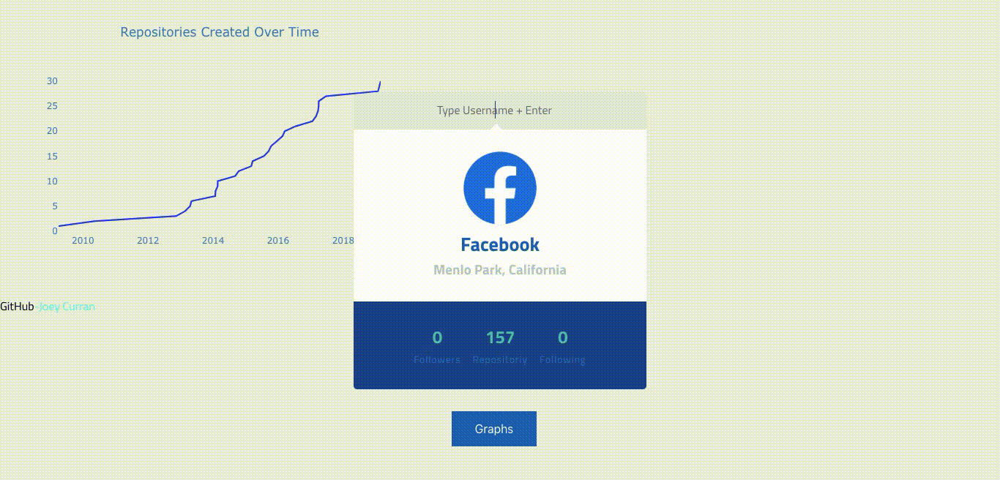
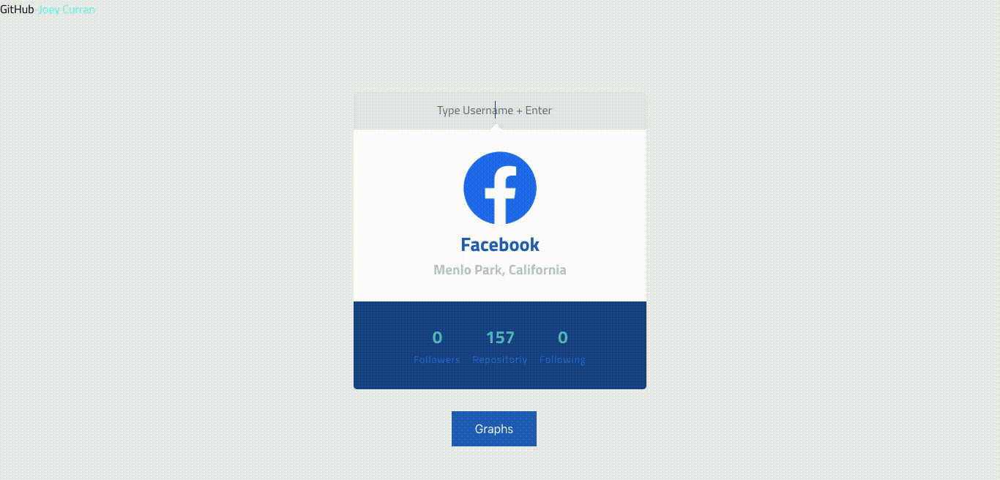

# SWENG Git Access Assignment Part 1 & 2

The project brief was to write a piece of software to interrogate the GitHub REST API v3

The first step was to simply connect to the api. I decided to implement OAuthentication for my solution. In hind sight it was neccessary but it does give slightly more information on the authenticated user.

This project was bootstrapped with http://github.com/sw-yx/create-react-app-parcel.

The next step was to query some software engineering metrics from the api, repositories created over time for example. The idea is to visualise the data in some interesting and meaningful way to give insights into a project's code repository.

The Graphs included in this site were implimented using the D3.js library, a library used for graphing data. The graphs are shown on the screen using the graphs button seen under user profile.

 

This site was built using react and redux. React for a dynamic and interactive UI and Redux for state management e.g. storing data received from the api. The whole site was developed using Typescript which is a strictly typed superset of Javascript that compiles to plain javascript for great portability.

# To run my code locally yourself

A Node.js 8.0.0+ setup with yarn is recommended.

# use npm 
npm install

# serve with hot reload at localhost:1234
npm start

# build for production
npm build
